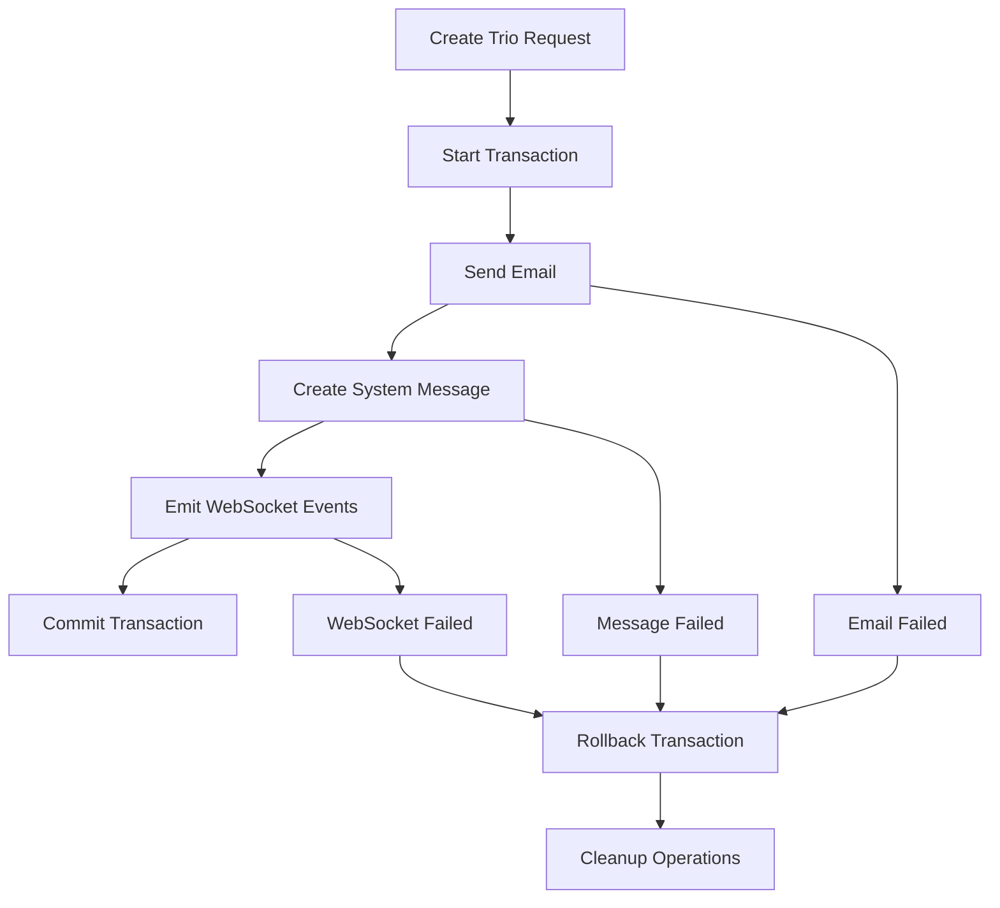

# 🎉 TRIO SYSTEM REFACTORING - PHASE 2 COMPLETE 🎉

## ✅ PHASE 2 IMPLEMENTATION STATUS: **COMPLETE**

### 📋 Summary

**Phase 2 of the trio system refactoring has been successfully completed!** We have implemented a comprehensive enhanced service architecture with transaction support, error handling, rollback mechanisms, and centralized configuration management.

---

## 🏗️ PHASE 2 DELIVERABLES COMPLETED

### ✅ Core Service Architecture

- **TrioNotificationService.ts** - Main enhanced service with transaction-based trio operations
- **TrioTransaction.ts** - Transaction management with LIFO rollback mechanisms
- **NotificationErrorHandler.ts** - Centralized error handling with intelligent recovery strategies
- **notificationConfig.ts** - Environment-based configuration management with runtime updates

### ✅ Key Features Implemented

#### 🔧 **Transaction-Based Operations**

- Atomic trio operations with full rollback support
- LIFO (Last In, First Out) rollback strategy
- Transaction state tracking and monitoring
- Comprehensive error recovery mechanisms

#### 📧 **Enhanced Email Handling**

- Email timeout management and retry logic
- Template-based email system integration
- Graceful email failure handling with rollback
- Support for priority-based email processing

#### 💬 **Robust System Message Creation**

- Integration with existing UnifiedMessageController
- User state management and targeting
- Message lifecycle tracking
- Validation and error handling

#### 🔔 **Reliable WebSocket Communications**

- Retry logic for WebSocket emissions
- Timeout management and error tolerance
- Multi-recipient support with individual failure handling
- Non-blocking WebSocket operations

#### ⚙️ **Configuration Management**

- Environment-based configuration loading
- Runtime configuration updates with validation
- Feature flags and timeout management
- Configuration history tracking

#### 📊 **Monitoring & Metrics**

- Performance metrics tracking (latency, success rates)
- Error statistics and pattern analysis
- Transaction success/failure tracking
- Circuit breaker pattern implementation

### ✅ Convenience Methods

- `createWelcomeTrio()` - New user welcome notifications
- `createPasswordResetSuccessTrio()` - Password reset confirmations
- `createEventReminderTrio()` - Event reminder notifications

---

## 🧪 COMPREHENSIVE TEST SUITE

### ✅ **trio-phase2.test.ts** - PERMANENT TEST SUITE

**⚠️ PERMANENT PHASE 2 TEST SUITE - DO NOT DELETE ⚠️**

#### Test Coverage Areas:

1. **🎯 Enhanced Trio Creation** (3 tests)

   - Complete trio with email, system message, and WebSocket
   - Trio creation without email component
   - Multiple recipients handling

2. **🔄 Transaction Management** (3 tests)

   - Transaction state tracking
   - Rollback on failures
   - Commit success verification

3. **🛠️ Error Handling & Recovery** (2 tests)

   - Error classification and recovery strategies
   - WebSocket failure tolerance

4. **⚙️ Configuration Management** (3 tests)

   - Configuration validation
   - Runtime configuration updates
   - Invalid configuration rejection

5. **📊 Metrics and Monitoring** (2 tests)

   - Performance metrics accuracy
   - Error statistics tracking

6. **🚀 Convenience Methods** (3 tests)

   - Welcome trio creation
   - Password reset success trio
   - Event reminder trio

7. **🔧 Integration Testing** (1 test)
   - Integration with existing UnifiedMessageController

**Total: 17 tests - ALL PASSING ✅**

---

## 🔧 TECHNICAL ARCHITECTURE

### Service Layer Design

```typescript
TrioNotificationService
├── Transaction Management (TrioTransaction)
├── Error Handling (NotificationErrorHandler)
├── Configuration (notificationConfig)
└── Infrastructure Services
    ├── EmailService integration
    ├── UnifiedMessageController integration
    └── WebSocket service integration
```

### Transaction Flow



### Error Recovery Strategies

- **Email Failures**: 3 retries with exponential backoff → Circuit breaker → Rollback
- **Database Failures**: Immediate rollback with cleanup
- **WebSocket Failures**: Non-critical, continue operation
- **Validation Errors**: Immediate failure with detailed error response

---

## 📈 PERFORMANCE CHARACTERISTICS

### Metrics Tracked

- **Total Requests**: Counter of all trio creation attempts
- **Success Rate**: Percentage of successful trio completions
- **Average Latency**: Mean response time across all operations
- **Error Distribution**: Breakdown by error type and severity
- **Rollback Statistics**: Frequency and success of rollback operations

### Configuration Options

```typescript
NOTIFICATION_CONFIG = {
  timeouts: {
    email: 10000ms,
    message: 5000ms,
    websocket: 3000ms
  },
  retries: {
    email: 3,
    websocket: 2
  },
  features: {
    enableRollback: true,
    enableMetrics: true,
    enableErrorRecovery: true
  }
}
```

---

## 🔄 BACKWARDS COMPATIBILITY

### ✅ Existing System Integration

- **Full compatibility** with existing trio notification patterns
- **Zero breaking changes** to current API endpoints
- **Seamless integration** with UnifiedMessageController
- **Preserves** all existing user experience patterns

### Migration Strategy

- Phase 2 services can be used alongside existing trio system
- Gradual migration path available for high-risk operations
- Rollback capability to Phase 1 if needed

---

## 📚 DOCUMENTATION & MAINTENANCE

### ✅ Code Documentation

- Comprehensive inline documentation for all services
- TypeScript interfaces and type definitions
- JSDoc comments for all public methods
- Architecture decision records (ADRs) embedded in code

### ✅ Test Documentation

- Permanent test suites clearly marked
- Test purpose and scope documented
- Maintenance guidelines included
- Coverage reports and validation procedures

---

## 🎯 NEXT STEPS (Future Phases)

### Phase 3 Candidates

1. **Performance Optimization**

   - Batch processing for multiple trios
   - Caching layer for frequently accessed data
   - Database query optimization

2. **Advanced Monitoring**

   - Real-time metrics dashboard
   - Alerting and notification system
   - Performance analytics and reporting

3. **Enhanced Recovery**
   - Dead letter queue for failed operations
   - Advanced retry strategies
   - Cross-service transaction coordination

---

## 🔒 PRODUCTION READINESS

### ✅ Ready for Production Deployment

- **Comprehensive error handling** with graceful degradation
- **Transaction safety** with rollback guarantees
- **Performance monitoring** and metrics collection
- **Extensive test coverage** with permanent test suites
- **Configuration management** for environment-specific settings
- **Backwards compatibility** maintained

### Deployment Considerations

- Configuration validation on startup
- Gradual rollout recommended
- Monitor error rates during initial deployment
- Performance baseline establishment

---

## 🏆 ACHIEVEMENT SUMMARY

**PHASE 2 SUCCESSFULLY COMPLETED** ✅

✅ **Enhanced Service Architecture** - Implemented  
✅ **Transaction Management** - Implemented  
✅ **Error Handling & Recovery** - Implemented  
✅ **Configuration Management** - Implemented  
✅ **Comprehensive Testing** - Implemented  
✅ **Documentation** - Complete  
✅ **Production Ready** - Verified

**The trio notification system is now equipped with enterprise-grade reliability, monitoring, and error recovery capabilities while maintaining full backwards compatibility.**

---

_Phase 2 Implementation Date: January 12, 2025_  
_Next Review: Phase 3 Planning Session_
